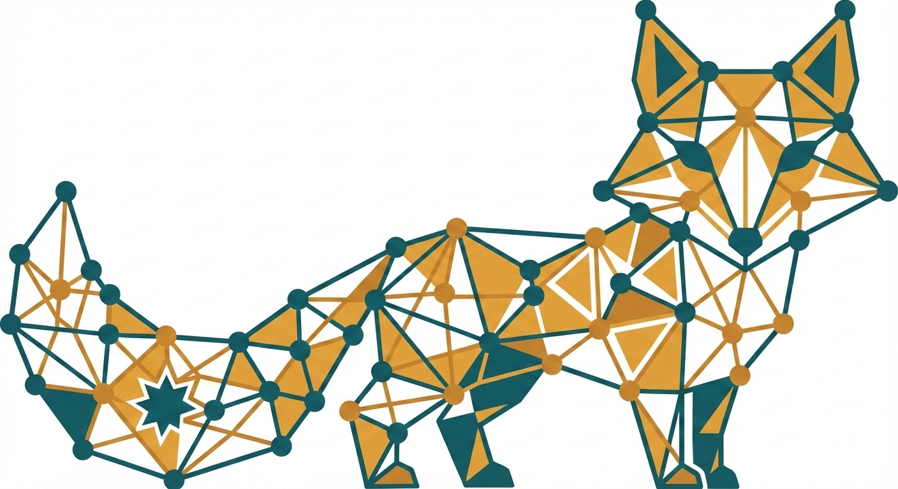
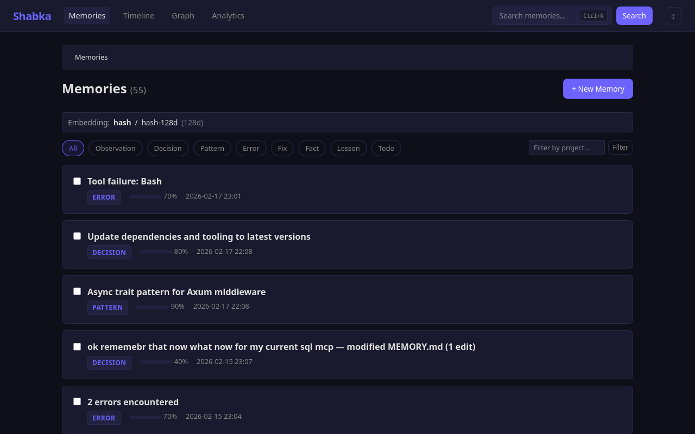
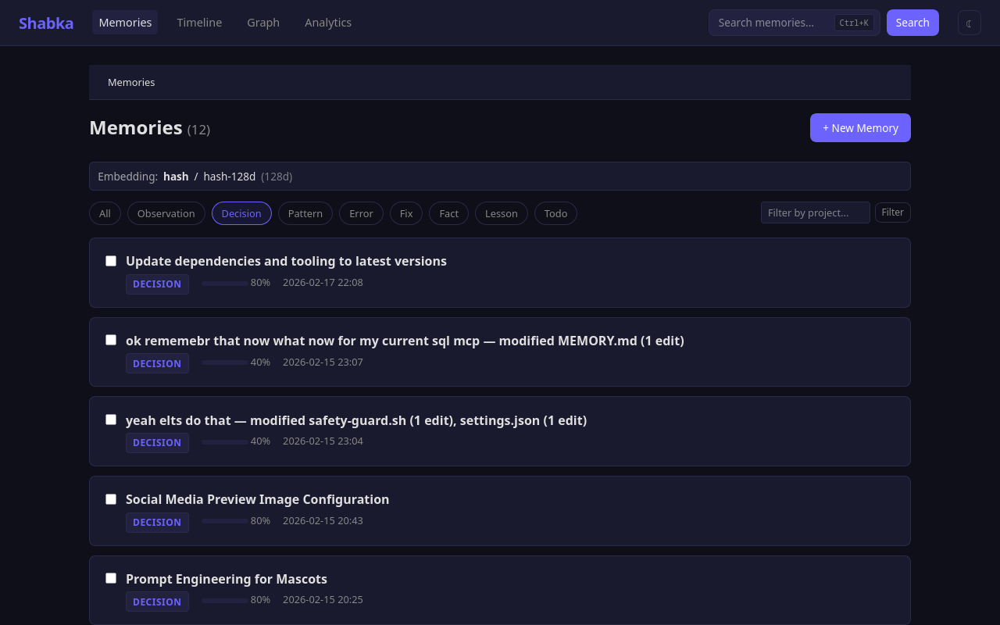

<p align="center">
  
</p>

<h1 align="center">Shabka</h1>

<p align="center">Persistent memory for LLM coding agents.<br>Save, search, and connect knowledge across AI sessions.</p>

LLMs forget everything between sessions. Shabka fixes that.

Shabka is an MCP server backed by [HelixDB](https://github.com/HelixDB/helix-db) (a graph-vector database) that gives AI coding assistants persistent, searchable memory. Memories are stored as nodes with vector embeddings for semantic search, connected by typed edges for relationship-aware retrieval.

## Why Shabka?

- **Persistent memory** — Decisions, patterns, and lessons survive across sessions. No more re-explaining your codebase.
- **Team knowledge sharing** — Share context across team members with privacy controls (public, team, private).
- **Zero-effort capture** — Auto-captures insights from Claude Code sessions via hooks. No manual saving needed.
- **Works everywhere** — MCP server for Claude/Cursor, plus a CLI and web dashboard for browsing and managing memories.

## Screenshots

| Dashboard | Search | Detail |
|:-:|:-:|:-:|
|  |  |  |
| Memory list with kind filters | Filter by kind, tag, project | Markdown content, relations, metadata |

| Knowledge Graph | Analytics |
|:-:|:-:|
|  |  |
| Interactive graph visualization | Quality score, charts, stats |

## Quick Start

### 1. Install HelixDB

```bash
# Build from source (required on Ubuntu 20.04 / WSL2)
cargo install --git https://github.com/HelixDB/helix-db helix-cli

# Or use the installer (Ubuntu 22.04+)
curl -sSL https://install.helix-db.com | bash
```

### 2. Start HelixDB

```bash
cd helix && helix push dev
```

### 3. Register the MCP server

```bash
claude mcp add shabka -- cargo run --manifest-path /path/to/shabka/Cargo.toml -p shabka-mcp --no-default-features
```

Open a new Claude Code session — the 12 Shabka tools are now available. Try: *"Save a memory about how our auth system works"* or *"Search for authentication"*.

## CLI Highlights

Install with `cargo install --path crates/shabka-cli --no-default-features`.

```bash
shabka search "auth tokens"           # Semantic + keyword hybrid search
shabka get a1b2c3d4                   # View memory details (short ID prefix)
shabka chain a1b2c3d4 --depth 3      # Follow relation chains
shabka status                         # HelixDB health + memory count
shabka context-pack "project setup"   # Paste-ready context block for LLMs
```

See [docs/cli.md](docs/cli.md) for the full command reference.

## Web Dashboard

```bash
cargo run -p shabka-web --no-default-features   # http://localhost:37737
```

Browse, search, and manage memories with markdown rendering, graph visualization, analytics, and dark/light theme. See [docs/web-dashboard.md](docs/web-dashboard.md).

## Documentation

| Document | Description |
|----------|-------------|
| [Configuration](docs/configuration.md) | TOML config reference, embedding providers, layered config |
| [CLI Reference](docs/cli.md) | All commands and flags |
| [Web Dashboard](docs/web-dashboard.md) | Dashboard features, REST API endpoints |
| [API Reference](docs/api.md) | MCP tools (12), REST API, retrieval patterns |
| [Architecture](docs/architecture.md) | System diagram, workspace crates, project structure |
| [Development](docs/development.md) | Build commands, testing, resetting HelixDB |

## License

MIT OR Apache-2.0
