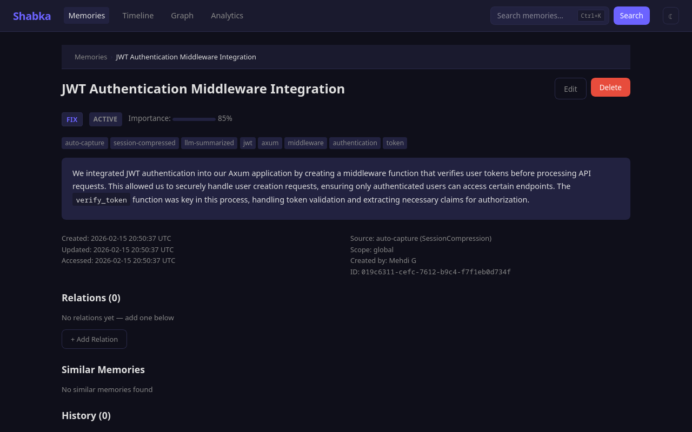
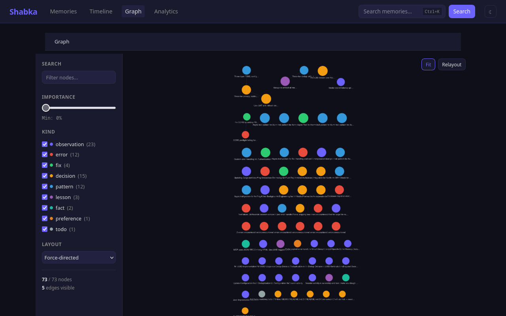
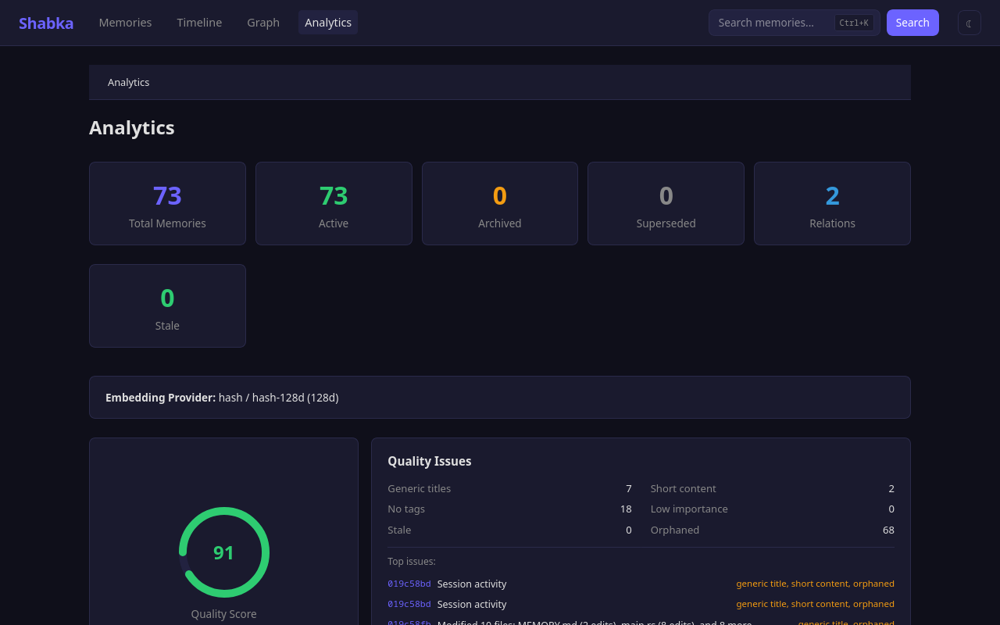

<p align="center">
  
</p>

<h1 align="center">Shabka</h1>

<p align="center">Persistent memory for LLM coding agents.<br>Save, search, and connect knowledge across AI sessions.</p>

<p align="center">
  <a href="https://github.com/mehdig-dev/shabka/actions"></a>
  <a href="https://crates.io/crates/shabka-core"></a>
  <a href="https://docs.rs/shabka-core"></a>
  <a href="#license"></a>
</p>

LLMs forget everything between sessions. Shabka fixes that.

Shabka is an MCP server that gives AI coding assistants persistent, searchable memory. It uses **SQLite by default** (zero setup) with optional [HelixDB](https://github.com/HelixDB/helix-db) for graph-vector features. Memories are stored with vector embeddings for semantic search and connected by typed relations for relationship-aware retrieval. **15 MCP tools**, a CLI, and a web dashboard included.

## Why Shabka?

- **Persistent memory** — Decisions, patterns, and lessons survive across sessions. No more re-explaining your codebase.
- **Team knowledge sharing** — Share context across team members with privacy controls (public, team, private).
- **Zero-effort capture** — Auto-captures insights from Claude Code sessions via hooks. No manual saving needed.
- **Works everywhere** — MCP server for Claude/Cursor, plus a CLI and web dashboard for browsing and managing memories.

## Works With

| Client | Transport | Guide |
|--------|-----------|-------|
| Claude Code | stdio | [Setup](docs/src/clients/claude-code.md) |
| Cursor | HTTP | [Setup](docs/src/clients/cursor.md) |
| Windsurf | HTTP | [Setup](docs/src/clients/windsurf.md) |
| Cline | stdio or HTTP | [Setup](docs/src/clients/cline.md) |
| Continue | stdio | [Setup](docs/src/clients/continue.md) |

Any MCP-capable client can connect via `shabka-mcp --http 8080`.

## Screenshots

| Dashboard | Search | Detail |
|:-:|:-:|:-:|
|  |  |  |
| Memory list with kind filters | Filter by kind, tag, project | Markdown content, relations, metadata |

| Knowledge Graph | Analytics |
|:-:|:-:|
|  |  |
| Interactive graph visualization | Quality score, charts, stats |

## Quick Start

### Option A: Install script (recommended)

```bash
curl -sSf https://raw.githubusercontent.com/mehdig-dev/shabka/main/install.sh | sh
```

### Option B: Homebrew (macOS / Linux)

```bash
brew install mehdig-dev/tap/shabka
```

### Option C: From crates.io

```bash
cargo install shabka-cli shabka-mcp
```

### Register the MCP server

```bash
claude mcp add shabka shabka-mcp
```

### Try it

Open a new Claude Code session — the 15 Shabka tools are now available. Try:

- *"Save a memory about how our auth system works"*
- *"Search for authentication"*
- *"What do you remember about the database schema?"*

That's it — SQLite storage works out of the box with zero configuration.

## Try It in 30 Seconds

```bash
shabka demo                    # Seed 12 sample memories
shabka tui                     # Browse interactively
shabka search "authentication" # Search from CLI
```

<details>
<summary><strong>Advanced: HelixDB backend</strong></summary>

For graph-vector features (native vector search, graph traversals), you can switch to HelixDB:

1. **Install HelixDB:**
   ```bash
   cargo install --git https://github.com/HelixDB/helix-db helix-cli
   ```

2. **Start the database:**
   ```bash
   cd helix && helix push dev
   ```

3. **Update config** (`~/.config/shabka/config.toml`):
   ```toml
   [storage]
   backend = "helix"
   ```

</details>

## CLI Highlights

```bash
shabka search "auth tokens"           # Semantic + keyword hybrid search
shabka get a1b2c3d4                   # View memory details (short ID prefix)
shabka chain a1b2c3d4 --depth 3      # Follow relation chains
shabka status                         # Storage health + memory count
shabka context-pack "project setup"   # Paste-ready context block for LLMs
```

See [docs/src/guide/cli.md](docs/src/guide/cli.md) for the full command reference.

## Web Dashboard

```bash
cargo run -p shabka-web --no-default-features   # http://localhost:37737
```

Browse, search, and manage memories with markdown rendering, graph visualization, analytics, and dark/light theme. See [docs/src/guide/web-dashboard.md](docs/src/guide/web-dashboard.md).

## Documentation

| Document | Description |
|----------|-------------|
| [Configuration](docs/src/getting-started/configuration.md) | TOML config reference, embedding providers, `[storage]` backend selection |
| [CLI Reference](docs/src/guide/cli.md) | All commands and flags |
| [Web Dashboard](docs/src/guide/web-dashboard.md) | Dashboard features, REST API endpoints |
| [API Reference](docs/src/guide/api.md) | 15 MCP tools, REST API, retrieval patterns |
| [Client Setup Guides](docs/src/clients/) | Claude Code, Cursor, Windsurf, Cline, Continue |
| [Architecture](docs/src/reference/architecture.md) | System diagram, workspace crates, project structure |
| [Development](docs/src/reference/development.md) | Build commands, testing, storage backends |

## License

MIT OR Apache-2.0
